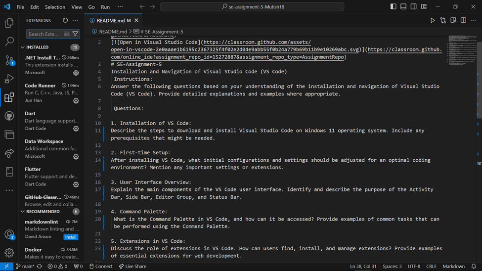

# SE-Assignment-5
Installation and Navigation of Visual Studio Code (VS Code)
 Instructions:
Answer the following questions based on your understanding of the installation and navigation of Visual Studio Code (VS Code). Provide detailed explanations and examples where appropriate.

 Questions:

1. Installation of VS Code:
Describe the steps to download and install Visual Studio Code on Windows 11 operating system. Include any prerequisites that might be needed.

INSTALLATION OF VS CODE:
DESCRIBE THE STEPS TO DOWNLOAD AND INSTALL VISUAL STUDIO CODE ON WINDOWS 11 OPERATING SYSTEM. INCLUDE ANY PREREQUISITES THAT MIGHT BE NEEDED.
Visual studio code is a software that is used to be able to be used to analyze code for an individual who wants to code. This is to mean that Visual Studio Code will analyze if a code is written correctly and it will identify errors and provide solutions. 
You must ensure that your operating system has enough space to operate the app.
The following are the steps needed to do so: 
•	Go to your browser
•	Search Visual Studio Code
•	Choose first link and go to the download section
•	Select the device that you are using, i.e. , Windows, Mac

•	Selects the second folder as the first is a lite file
•	Click download 
•	Open downloads

•	Run the download
•	Accept the license agreement 
•	Choose installation location- mine was downloads
•	Select to have desktop icon 
•	Click install

2. First-time Setup:
After installing VS Code, what initial configurations and settings should be adjusted for an optimal coding environment? Mention any important settings or extensions.

FIRST-TIME SETUP:
AFTER INSTALLING VS CODE, WHAT INITIAL CONFIGURATIONS AND SETTINGS SHOULD BE ADJUSTED FOR AN OPTIMAL CODING ENVIRONMENT? MENTION ANY IMPORTANT SETTINGS OR EXTENSIONS.
Visual studio code needs to be configured in order to be used with ease and convenience. Some of the initial configurations made include the following:
•	Configure your font
•	Ensure that all the extensions are installed

•	Ensure that your VS Code is connected to your Github

3. User Interface Overview:
Explain the main components of the VS Code user interface. Identify and describe the purpose of the Activity Bar, Side Bar, Editor Group, and Status Bar.

USER INTERFACE OVERVIEW:
EXPLAIN THE MAIN COMPONENTS OF THE VS CODE USER INTERFACE. IDENTIFY AND DESCRIBE THE PURPOSE OF THE ACTIVITY BAR, SIDE BAR, EDITOR GROUP, AND STATUS BAR.
The user interface of the VS Code is the outlook of how the visual studi9o code should be. This is to mean that there are certain elements that are inputted in the application to ensure that the application is able to function optimally. The areas include the activity bar which entails the following:
•	Explorer 
•	Search Bar 
•	Run and Debug
•	Extensions 
•	Github
•	Database Projects
•	Live Share

4. Command Palette:
 What is the Command Palette in VS Code, and how can it be accessed? Provide examples of common tasks that can be performed using the Command Palette.

 COMMAND PALETTE:
WHAT IS THE COMMAND PALETTE IN VS CODE, AND HOW CAN IT BE ACCESSED? PROVIDE EXAMPLES OF COMMON TASKS THAT CAN BE PERFORMED USING THE COMMAND PALETTE.
How to Access the Command Palette
Press Ctrl + Shift + P on Windows.
This process highlights the areas where the user can go and use different elements for your coding experience. Some of these elements include the following:
•	Bookmarks
•	Debugging
•	Extensions
•	Files and Folders
•	Testing 
•	Terminals 
•	Viewing

5. Extensions in VS Code:
Discuss the role of extensions in VS Code. How can users find, install, and manage extensions? Provide examples of essential extensions for web development.

EXTENSIONS IN VS CODE:
DISCUSS THE ROLE OF EXTENSIONS IN VS CODE. HOW CAN USERS FIND, INSTALL, AND MANAGE EXTENSIONS? PROVIDE EXAMPLES OF ESSENTIAL EXTENSIONS FOR WEB DEVELOPMENT.
Extensions in Visual Studio code are very important. This is because they are used to be able be able in the reading of coding language that will be used in the coding process. There are various coding language that are used in the coding process and each language needs to be interpreted in the right manner. This will employ the use of extensions that can be installed directly in the Visual Studio Code app and run without any issues. It is important to note that the extensions that will be needed to be installed should be from verified sources. Some examples of these extensions include Code Runner, Dart, Flutter, Github classroom and Pylance.

6. Integrated Terminal:
Describe how to open and use the integrated terminal in VS Code. What are the advantages of using the integrated terminal compared to an external terminal?

INTEGRATED TERMINAL:
DESCRIBE HOW TO OPEN AND USE THE INTEGRATED TERMINAL IN VS CODE. WHAT ARE THE ADVANTAGES OF USING THE INTEGRATED TERMINAL COMPARED TO AN EXTERNAL TERMINAL?
Integrated terminal is a terminal that is found within the visual studio code programme and also used to be able to analyze code and even push it to your local repository to avoid work loss. To open a Visual Studio Code Terminal, one should navigate to the top pane and locate the three dots. Click the three dots and go to the terminal section. Create a new terminal and use this terminal for your work process in the code.
The advantages of using integrated terminal is that it is able to address the work at hand and detect any changes or even make any necessary changes to your work without ease.

7. File and Folder Management:
Explain how to create, open, and manage files and folders in VS Code. How can users navigate between different files and directories efficiently?

FILE AND FOLDER MANAGEMENT:
EXPLAIN HOW TO CREATE, OPEN, AND MANAGE FILES AND FOLDERS IN VS CODE. HOW CAN USERS NAVIGATE BETWEEN DIFFERENT FILES AND DIRECTORIES EFFICIENTLY?
A user can create a file that they will use for their coding journey. The process of creating file entails the aspect going to a new window and creating a file or a folder depending on the preference of the user.
After one has opened the file inside it and choose where they should perform their various edits. One can even open multiple folders and files depending on the amount of work that they are doing. This is to mean that you can open multiple files and folders and work on them but one just has to switch tabs in the Visual Studio Workspace.

8. Settings and Preferences:
   - Where can users find and customize settings in VS Code? Provide examples of how to change the theme, font size, and keybindings.

SETTINGS AND PREFERENCES:
WHERE CAN USERS FIND AND CUSTOMIZE SETTINGS IN VS CODE? PROVIDE EXAMPLES OF HOW TO CHANGE THE THEME, FONT SIZE, AND KEYBINDINGS.
Via the User Interface (UI):
•	Open the Command Palette- CTRL Shift P
•	You can then select 
Changing the Theme
Using the UI:
•	Go to File
•	Select Preferences 
•	Select Color Theme
•	Select a theme from the list that appears.

9. Debugging in VS Code:
Outline the steps to set up and start debugging a simple program in VS Code. What are some key debugging features available in VS Code?

DEBUGGING IN VS CODE:
OUTLINE THE STEPS TO SET UP AND START DEBUGGING A SIMPLE PROGRAM IN VS CODE. WHAT ARE SOME KEY DEBUGGING FEATURES AVAILABLE IN VS CODE?
The process of debugging can be defined as the process using a programming language in order for the visual studio software to be able to comprehend and identify the codes that will be entered. To be able to employ this technique one has to have installed the various programming languages as extensions in the VS Code before starting work on your applications. These debugging features also facilitate with linking with various command prompts. 
Some of the debugging features in VS Code include the Debug console in VS Code. 

10. Using Source Control:
How can users integrate Git with VS Code for version control? Describe the process of initializing a repository, making commits, and pushing changes to GitHub.

A Git repository can be defined as a repository that can be used to be able to store all of your projects that have been edited in the Visual Studio Code and other places. It ensures that the code developed in the visual studio code is not lost.
In order to be able to connect our Git repository and your Git bash account, one has to have downloaded git bash. Git bash is downloaded through the following process:
•	Install Git Bash from www.git-scm.com

•	Run the installed app
•	Select in the Branching section Let Git decide
•	Select git from the command line 
•	Select Bundled Open SSH
•	Select default library
•	Select checkout windows style
•	Select use MinTTY
•	Select fast forward or merge
•	Install and run

After installing GitBash, run the following commands in the following steps:
•	git –version- gives details of the version
•	git config --global --list- shows everyone who has accessed github global users
•	git config --help
•	git
•	git -- help
•	git config -- global user.name “Benjamin Mutinda”
•	git config -- global user.email benjamutish123@gmail.com
•	git config -- global –list

One has to link the message that will be in the repository to the account at Github. This is done through the following steps:
•	Go to Git Bash
•	mkdir GitSession
•	cd GitSession
•	vim hello_git.py
•	vim READ.md

•	Press I to insert
•	Edit Text- This is my first Git session for introduction
•	Press ESC
•	It will take you to the bottom space 
•	Write :wq
In order to initialize a git repository for your project and make your first commit, there has to be the creation of a repository. This repository is created in the following way:
•	Open Git hub
•	Go to the icon on the far right and click it 
•	Go to new repository 
•	Name your repository the way you want it to appear 

•	Choose whether the repository should be public or private
•	Scroll down and create the repository

After creating the directory, the repository has to be initialized and a commit to be made. This is done through the following steps:
•	Go to GitBash
•	git init
•	git. add
•	git commit –m “Filename”
•	Copy link from command line in the repository 
•	git push –u origin master “link copied”
•	Go to Github and check

 Submission Guidelines:
- Your answers should be well-structured, concise, and to the point.
- Provide screenshots or step-by-step instructions where applicable.
- Cite any references or sources you use in your answers.
- Submit your completed assignment by 1st July 

